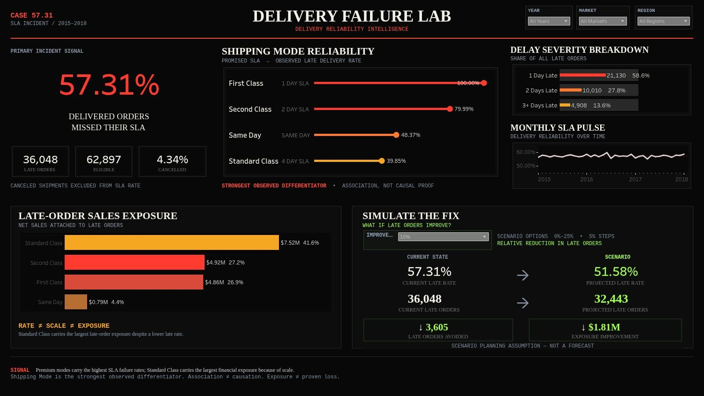

# Delivery Failure Lab

**SLA reliability and sales exposure | Lutfi Luthoifi**

I audited 180,519 order-item records into 65,752 unique orders, established consistent delivery KPIs, and built a Tableau dashboard to help prioritize further investigation. The analysis separates late rates, order volume, and the value of sales attached to late orders.

[Explore Dashboard](https://public.tableau.com/app/profile/lutfi.luthoifi/viz/Delivery_Failure_Lab_FINAL/DeliveryFailureLab) · [View Presentation](https://docs.google.com/presentation/d/1fHkn5w-8Q7_h_KUt3C280WTGMatdZOuT9IgMjvwxF2s/edit?usp=drivesdk) · [Analysis Notebook](notebooks/delivery_failure_analysis.ipynb) · [Project Documentation (DOCX)](https://docs.google.com/document/d/1b1msl2l-zXMWoltpB6G38XJ9TiaEuGL8/edit?usp=drivesdk&ouid=113182415142613247086&rtpof=true&sd=true)

## Business problem

More than half of eligible orders missed the dataset's scheduled shipping SLA. Which services should an operations team investigate first, and how can a proposed improvement be expressed with clear assumptions?

The decision requires several views. A high late rate identifies a reliability problem, while late-order volume and associated sales indicate its scale. This is a historical portfolio study, not an implemented operational intervention.

## Data

The analysis uses the DataCo supply-chain dataset, covering January 2015 to January 2018. The original project imported a Google Sheets copy of the data.

| Audit stage | Count | Meaning |
|---|---:|---|
| Raw input | 180,519 rows × 53 columns | One row per order item |
| Unique orders | 65,752 | One row per `Order Id` after aggregation |
| Shipping canceled | 2,855 | Excluded from the SLA denominator |
| Eligible orders | 62,897 | Base for late, on-time, and early rates |
| Late orders | 36,048 | Eligible orders with a positive SLA gap |

**Dataset source:** Constante, Fabian; Silva, Fernando; Pereira, António (2019). [DataCo SMART SUPPLY CHAIN FOR BIG DATA ANALYSIS, Mendeley Data, V5](https://data.mendeley.com/datasets/8gx2fvg2k6/5), DOI: 10.17632/8gx2fvg2k6.5. The source lists CC BY 4.0. Download the source data there; this folder contains aggregate results and analysis assets, with no raw or processed row-level dataset.

## Methodology

1. **Audit the grain.** Check identifiers, line counts, and shipping-attribute consistency within each order.
2. **Build the order model.** Take consistent order attributes once and sum item-level financial values. Reconcile totals before and after aggregation.
3. **Validate the KPI.** Recalculate `SLA_Gap_Days = Actual_Shipping_Days - Scheduled_Shipping_Days`. Exclude shipping-canceled orders from SLA outcomes. The recalculated late flag matches the supplied flag for all eligible orders.
4. **Check dates and quality.** Inspect missing values, duplicates, timestamps, and the calendar-day convention used by the recorded shipping duration.
5. **Compare services.** Review shipping modes, monthly trends, severity, customer segments, markets, regions, and order complexity. Use bias-corrected Cramér's V to compare categorical associations.
6. **Measure exposure and scenarios.** Sum net sales associated with late orders and calculate relative improvement scenarios at a fixed eligible volume.
7. **Publish and communicate.** Export the order model for Tableau, add filters and a scenario parameter, and explain results in a presentation and project documentation.

**Tools:** Python, pandas, NumPy, SciPy, matplotlib, Google Sheets, and Tableau Public.

## Key findings

| Shipping mode | Eligible orders | Late orders | Late rate | Late-order net sales |
|---|---:|---:|---:|---:|
| First Class | 9,602 | 9,602 | 100.00% | $4.86M |
| Second Class | 12,256 | 9,803 | 79.99% | $4.92M |
| Same Day | 3,407 | 1,648 | 48.37% | $0.79M |
| Standard Class | 37,632 | 14,995 | 39.85% | $7.52M |

- **57.31%** of eligible orders were late. The cancellation rate was **4.34%** of all orders, using a separate denominator.
- First Class and Second Class had the highest late rates. Standard Class had the most late orders and **41.6% of total late-order sales exposure**.
- Shipping mode had the strongest tested association with late status, with bias-corrected **Cramér's V = 0.481**. Each mode also sets its own SLA cutoff, so part of the association reflects the KPI definition.
- **58.6% of late orders were one day late.** Aggregate monthly late rates ranged from **55.04% to 59.86%** across 37 months.
- Total net sales attached to late orders were **$18.08M**. Recorded profit on these orders was **$2.14M**. Neither number estimates losses caused by delay.

## Dashboard and scenario

The dashboard combines an SLA baseline, shipping-mode reliability, delay severity, a monthly trend, and sales exposure. Year, market, and region selections apply across the view.

The simulator offers 0%–25% relative improvement in 5% steps. At the default **10% relative reduction**, the historical baseline implies **3,605 fewer late orders**, **32,443 remaining late orders**, and a **51.58% projected late rate**. About **$1.81M** of sales exposure moves out of the late category under the scenario assumptions. This is not additional revenue, cash savings, a forecast, or an achieved result.

The published Tableau simulator supports 0%–25% relative improvement in 5% steps. At the default 10% scenario, 36,048 late orders become 32,443 projected late orders, equivalent to a 51.58% projected late rate at fixed eligible volume. The scenario is directional and does not represent a forecast or realized savings.

## Limitations

- Historical, observational data cannot establish an operational root cause or current service performance.
- Carrier, warehouse capacity, staffing, pick/pack milestones, dispatch queues, route conditions, and delivery-confirmation timestamps are unavailable.
- The recorded actual days follow calendar dates. All eligible Same Day orders have a 12-hour order-to-shipping interval, yet crossing midnight changes the late flag. Service cutoffs and timestamp meanings need validation.
- January 2018 covers Pacific Asia only. It is not a full year or a like-for-like annual comparison.
- Refunds, claims, compensation, incremental logistics costs, and churn data are absent. Financial exposure must not be presented as proven loss.

## Recommendations

Validate the SLA definitions and feasibility of First Class and Second Class. Investigate Standard Class because it carries the largest late volume and associated sales. Select an intervention after collecting process evidence, then run a 90-day pilot with a comparable control or baseline. Track late rate alongside cancellation, shipping cost, and customer-claim measures. The proposed six-month objective is a 10% relative reduction in late orders, subject to pilot evidence.

## Project files

| Resource | Contents |
|---|---|
| `notebooks/delivery_failure_analysis.ipynb` | Executed analysis notebook used for the project, with saved outputs |
| [Google Slides presentation](https://docs.google.com/presentation/d/1fHkn5w-8Q7_h_KUt3C280WTGMatdZOuT9IgMjvwxF2s/edit?usp=drivesdk) | Editable 22-slide presentation |
| [Project documentation (DOCX)](https://docs.google.com/document/d/1b1msl2l-zXMWoltpB6G38XJ9TiaEuGL8/edit?usp=drivesdk&ouid=113182415142613247086&rtpof=true&sd=true) | Editable 16-page Indonesian methodology document |
| `outputs/` | Shipping mode, monthly SLA, financial exposure, association, and scenario CSVs |
| `images/dashboard-preview.webp` | Compressed screenshot of the published dashboard |

The presentation and documentation links point to the editable source files in Google Drive. The notebook in this repository is the executed project notebook used for the analysis.

## Notebook notes

The public notebook preserves the executed analysis and saved outputs used to build the published dashboard and presentation. It was developed in Google Colab, mounts Google Drive, and reads the project's Google Sheets copy of the DataCo dataset through authenticated access.

External viewers can review the complete code and outputs directly on GitHub. To reproduce the workflow independently, download the DataCo source linked above and adapt the notebook's input/output setup to a local or personal Drive environment.
